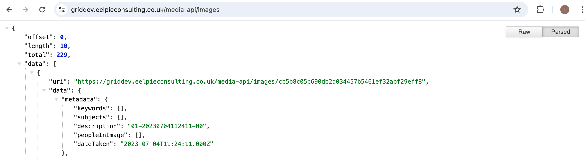
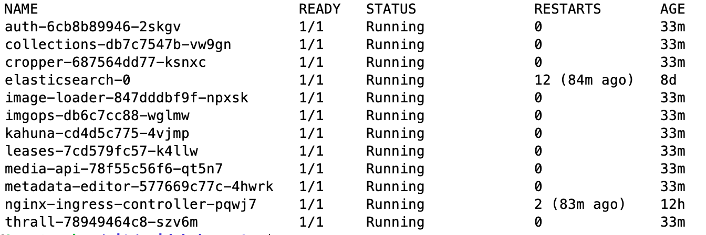

## Grid Kubernetes deploy 

Naive deployment of the Guardian Grid into Kubernetes.

Uses a Nginx ingress to remap the services from vhosts to sub paths. Allows the entire application to run from a single host name.

### Prerequisites

Assumes that the long-lived AWS dependencies (S3 buckets, Dynamo tables and message queues) already exist 
in a separate AWS account and that they will be accessed using an AWS access key and secret with appropriate access.

References to these AWS resources are marked with `TODO` in the configmap sources in `config`.

The image urls are public but you should be questioning their contents.
The availability and contents of the images is subject to change without warning.

### Screenshots

Image uploading, searching and cropping works end to end.

The API urls work when remapped from separate vhosts to sub paths.

Grid services running as pods.

)

